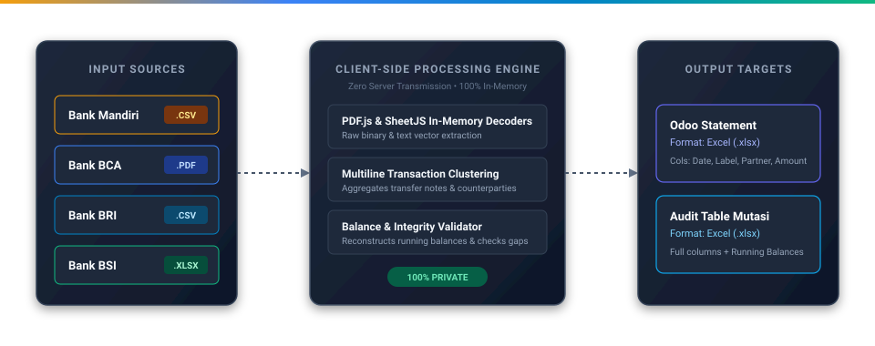

# Bank Statement Converter

Aplikasi parser rekening koran perbankan Indonesia (**Bank Mandiri**, **Bank Central Asia / BCA**, **Bank Rakyat Indonesia / BRI**, dan **Bank Syariah Indonesia / BSI**) berbasis *client-side* untuk mengonversi data mutasi transaksi langsung ke format standar **Odoo Bank Statement** dan lembar kerja audit Excel.

---

## Ringkasan Eksekutif

Proses rekonsiliasi akuntansi perusahaan kerap menghadapi kendala akibat format laporan mutasi rekening yang beragam dari setiap bank—mulai dari variasi pemisah delimiter CSV (koma, titik koma, tab), line-ending dari berbagai OS (Windows, Macintosh, Unix), dokumen PDF digital bertingkat, hingga berkas ekspor web HTML yang dinamai `.xls`. Mengonversi data tersebut ke dalam sistem ERP seperti Odoo Accounting sering kali menuntut input manual atau penggunaan aplikasi pihak ketiga yang berisiko terhadap kerahasiaan data.

**Bank Statement Converter** menghadirkan solusi otomasi konversi yang berjalan sepenuhnya di sisi peramban (*browser-native*). Seluruh proses parsing dieksekusi 100% di dalam memori RAM komputer pengguna tanpa melibatkan pengiriman file ke server luar, memastikan kepatuhan penuh terhadap standar privasi dan keamanan data finansial.

---

## Arsitektur Sistem & Alur Kerja



---

## Keunggulan & Kemampuan Utama

### 1. Arsitektur Client-Side Tanpa Pengiriman Data (Zero-Knowledge)
* Seluruh proses parsing, manipulasi teks, dan pembuatan file Excel berjalan langsung di dalam peramban web lokal.
* Tidak ada data mutasi rekening, nomor rekening, atau informasi nasabah yang dikirim ke server eksternal, API, maupun database luar.
* Dapat digunakan sepenuhnya secara *offline* setelah halaman dimuat.

### 2. Universal CSV Engine (Macintosh, MS-DOS, BOM-Cleaner)
* Otomatis mendeteksi pemisah kolom (*delimiter*): titik koma (`;`), koma (`,`), tab (`\t`), atau pipe (`|`).
* Kompatibel dengan semua jenis pemisah baris (*line endings*): `\r\n` (Windows/DOS), `\n` (Unix/Linux), dan `\r` (Macintosh klasik).
* Otomatis membersihkan karakter *Byte Order Mark* UTF-8 (`\uFEFF`) hasil ekspor Microsoft Excel.

### 3. Ekstraksi Vektor PDF Asli (BCA)
* Membaca file PDF e-statement BCA secara langsung menggunakan mesin pemroses PDF.js di memori peramban.
* Menghilangkan kebutuhan konversi manual PDF ke TXT menggunakan Foxit Reader atau software desktop lainnya.
* Menjaga urutan data transaksi secara presisi melalui pengelompokan koordinat geometri teks ($X$ dan $Y$).

### 4. Dukungan Format Ganda (CSV, XLSX, dan HTML-as-XLS)
* **Bank Mandiri & BRI**: Menerima langsung file `.csv` maupun file Excel asli `.xlsx / .xls` tanpa perlu konversi manual sebelum unggah.
* **Bank BSI**: Mendukung file binary `.xlsx` murni serta file `.xls` berbasis tabel HTML bawaan web export BSI Net Banking tanpa pesan *crash* atau *Invalid HTML*.

### 5. Validasi Struktur Kolom & Pesan Kesalahan Informatif
* Sistem memvalidasi keberadaan kolom wajib (Tanggal, Deskripsi/Remarks, Debit, Credit) pada berkas yang diunggah.
* Jika format kolom rusak atau tidak sesuai dengan bank yang dipilih, sistem langsung menampilkan pemberitahuan spesifik yang memandu pengguna mengenai kolom apa yang kurang.

### 6. Penggabungan Catatan Transaksi Bertingkat (Multiline)
* Menggabungkan otomatis informasi transaksi multi-baris (jenis mutasi, kode referensi transfer, berita acara, serta nama pengirim/penerima) menjadi satu deskripsi yang utuh.
* Mengklasifikasikan transaksi **Debet (DB)** sebagai arus kas keluar bernilai negatif dan **Credit (CR)** sebagai arus kas masuk bernilai positif.

### 7. Rekonsiliasi Saldo & Validasi Integritas Data
* Menghitung saldo berjalan secara otomatis baris demi baris dan mencocokkannya dengan saldo tercetak pada rekening koran.
* Memberikan indikator peringatan visual apabila ditemukan ketidaksesuaian saldo atau potensi transaksi yang terlewat.

### 8. Mesin Ekspor Ganda Standar Excel (.xlsx)
* **Odoo Bank Statement (.xlsx)**: Berisi 4 kolom standar (`Date`, `Label`, `Partner`, `Amount`) yang siap diimpor langsung ke modul Accounting Odoo.
* **Tabel Mutasi Lengkap (.xlsx)**: Menyajikan seluruh kolom transaksi, klasifikasi debet/kredit terpisah, serta riwayat saldo berjalan untuk keperluan audit internal.

---

## Bank yang Didukung & Format Input

| Institusi Perbankan | Format Input yang Diterima | Kanal Unduhan | Karakteristik Pemrosesan |
| :--- | :---: | :--- | :--- |
| **Bank Mandiri** | `.csv`, `.xlsx`, `.xls` | Kopra Mandiri / Mandiri Online | Deteksi otomatis variasi header kolom (`PostDate`, `Remarks`, `Debit`, `Credit`, `Balance`). Mendukung file CSV maupun Excel asli. |
| **Bank Central Asia (BCA)** | `.pdf` | KlikBCA Bisnis / E-Statement Rekening Giro & Tabungan | Ekstraksi langsung dari vektor PDF digital, rekonstruksi berita transfer multiline, resolusi tahun otomatis. |
| **Bank BRI** | `.csv`, `.xlsx`, `.xls` | CMS BRI / QLola / BRImo | Normalisasi kolom `TGL_TRAN`, `DESK_TRAN`, `REMARK_CUSTOM`, `MUTASI_DEBET`, `MUTASI_KREDIT`, dan `SALDO_AKHIR_MUTASI`. |
| **Bank Syariah Indonesia (BSI)** | `.xlsx`, `.xls` | BSI Net Banking / CMS Giro Wadiah | Ekstraksi metadata rekening, pemilik rekening, dan matriks transaksi multi-kolom. Mendukung format binary `.xlsx` dan `.xls` (HTML table export). |

---

## Skema Integrasi Odoo Accounting

File **Odoo Statement (.xlsx)** yang dihasilkan mengikuti spesifikasi resmi impor mutasi bank pada Odoo Accounting:

| Kolom Odoo | Tipe Data | Logika Transformasi | Contoh Hasil |
| :--- | :--- | :--- | :--- |
| **Date** | `YYYY-MM-DD` | Format ISO-8601 yang menggabungkan tanggal transaksi dengan tahun periode rekening. | `2026-02-01` |
| **Label** | `String` | Gabungan jenis mutasi, kode transaksi, berita/keterangan transfer, dan nama rekening lawan. | `TRSF E-BANKING CR 0102/FTSCY/WS95031 karpet mesjid IBNU JAYA IRIANTO` |
| **Partner** | `String` | Entitas rekanan (dapat diisi otomatis atau disesuaikan dengan aturan rekonsiliasi Odoo). | *(Opsional)* |
| **Amount** | `Numeric` | Nilai numerik standar desimal; **Positif** untuk Kredit (CR) dan **Negatif** untuk Debet (DB). | `200856.00` / `-50000.00` |

---

## Struktur Direktori Proyek

```text
Bank-statement-converter/
├── index.html                # Antarmuka utama aplikasi
├── LICENSE                   # Lisensi open-source MIT
├── .gitignore                # Pengecualian berkas sensitif dan repositori
├── public/
│   ├── BCA.png               # Aset logo perbankan
│   ├── Mandiri.png
│   ├── BRI.png
│   ├── BSI.png
│   └── workflow.svg          # Diagram visual alur kerja dan arsitektur
├── src/
│   ├── css/
│   │   └── style.css         # Desain antarmuka dan sistem layout
│   └── js/
│       ├── app.js            # Pengontrol utama dan router berkas
│       ├── csv-utils.js      # Engine normalisasi CSV universal (delimiter & line endings)
│       ├── bca-parser.js     # Mesin parsing PDF dan normalisasi data BCA
│       ├── mandiri-parser.js # Mesin parsing CSV & XLSX Bank Mandiri
│       ├── bri-parser.js     # Mesin parsing CSV & XLSX Bank BRI
│       └── bsi-parser.js     # Mesin parsing Excel & HTML-as-XLS Bank BSI
└── README.md                 # Dokumentasi teknis proyek
```

---

## Panduan Penggunaan & Deployment

Aplikasi ini tidak memerlukan proses *build* atau kompilasi khusus dan dapat langsung dijalankan pada berbagai lingkungan.

### Opsi 1: Buka Langsung (Tanpa Instalasi / Server)
Cukup **klik ganda (double-click) file `index.html`** pada File Explorer di komputer Anda, atau seret file tersebut ke peramban web pilihan Anda (Google Chrome, Microsoft Edge, Mozilla Firefox, Safari). Tidak memerlukan instalasi Node.js, Python, ataupun perintah terminal.

### Opsi 2: Menjalankan via Local Server (Opsional)
Jika ingin menjalankan menggunakan protokol HTTP lokal:

```bash
# Menggunakan Python
python -m http.server

# Menggunakan Node.js
npx serve .
```

### Opsi 3: Deployment Static Hosting
Dapat di-deploy secara langsung ke platform penyedia web statis:
* **GitHub Pages** (Aktifkan melalui menu Settings repositori)
* **Vercel** / **Netlify** / **Cloudflare Pages**
* **Nginx** / **Apache** / **AWS S3**

---

## Keamanan & Kerahasiaan Data

Data rekening koran merupakan informasi bisnis dan personal yang bersifat rahasia. Aplikasi ini menjamin keamanan informasi melalui:
1. **Pemrosesan Lokal Eksklusif**: File mutasi tidak pernah keluar dari perangkat pengguna.
2. **Penyimpanan Memori Volatil**: Data hanya diproses sementara dalam variabel RAM peramban selama tab dibuka dan tidak disimpan secara permanen.
3. **Tanpa Pelacakan**: Bebas dari skrip analitik, telemetri, atau pelacak pihak ketiga.

---

## Lisensi

Proyek ini dilisensikan di bawah [MIT License](LICENSE).